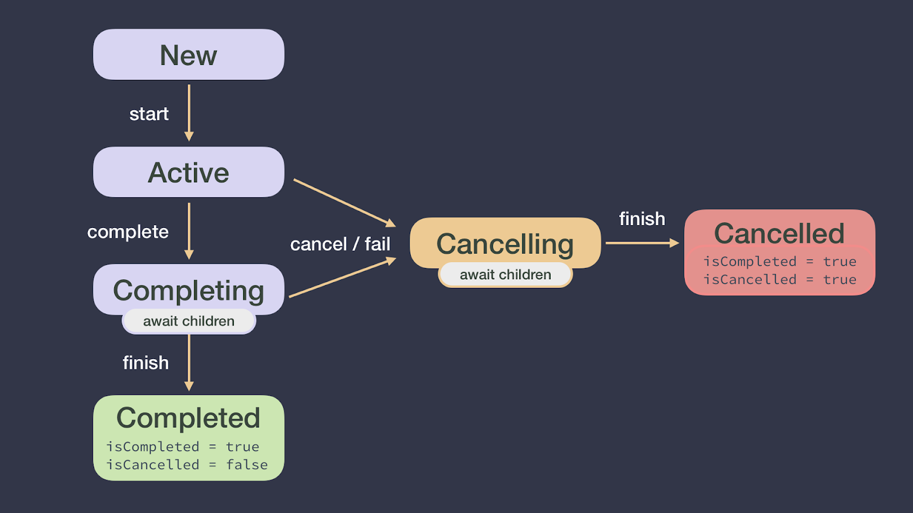

## Kotlin 协程基础原理

### 解决的问题

* 处理耗时任务，这些任务如果管理不当往往会阻塞主线程
* 保证主线程安全，主线程可以安全的调用任意suspend函数

### 基本概念

* async和launch的区别
  * async 启动新协程，并且允许使用await方法返回结果或抛出异常，可以执行并行分解
  * launch 启动新协程，没有返回结果
* suspend 挂起，复制并保存当前变量的堆栈帧
* resume 恢复，从挂起处恢复，并将堆栈帧从保存位置恢复
*  suspend 并不意味着告诉 Kotlin 要在后台线程上执行一个函数
*  生命周期



### 任务泄漏

指某个协程丢失无法追踪，它类似于内存泄漏，但更加糟糕，丢失的协程可以恢复自己，从而占用内存、CPU、磁盘资源，甚至发起一个网络请求。它所占用的资源无法得到重用。

**解决：**使用结构化并发机制，可以做到三件事，取消任务，追踪任务，发出错误信号。

### Dispatchers.Main.immediate 和 Dispatchers.Main

* Dispatchers.Main.immediate会立即执行，如果在主线程调用它，会以同步的方式立即执行
* Dispatchers.Main即使在主线程调用也不会立即执行。

### coroutineScope 和 supervisorScope

coroutineScope 和 supervisorScope 可以安全地从 suspend 函数中启动新协程，遵循结构化机制。

```kotlin
suspend fun fetchTwoDocs() {
    coroutineScope {
        launch { 
            fetchDoc(1) 
            }
        async { 
            fetchDoc(2) 
            }
    }
}
```
coroutineScope 构造器不会让 fetchTwoDocs发生泄漏，coroutinScope 会先将自身挂起，只有在 coroutineScope 构建器中启动的所有协程完成任务之后，fetchTwoDocs函数才会返回。

### 结构性并发

* 引入一个新的CoroutineScope,然后用这个scope去创建协程，并且根据需要取消任务，追踪任务，或者发出错误信号。

非结构性并发，如GlobalScope(全局作用域)，异常将无法正常的被捕获，造成丢失，还会造成任务泄漏。
```kotlin
try {
  GlobalScope.launch(Dispatchers.Main.immediate) {
      async {
            throw Exception("ERROR")
            }
          }
        } catch (e: Exception) {
            Log.d("测试","：$e")
}
```
结构性并发可以正常捕获异常，或者抛出给suspend调用方。
```kotlin
try {
     coroutineScope {
       async {
             throw Exception("ERROR")
             }
           }
        } catch (e: Exception) {
            Log.d("测试","：$e")
        }
```

### 异常处理机制

1. supervisorScope(或supervisorJob())

   如果一个子协程抛出异常，不会自动取消它以及其他子协程，需要在子协程序内部处理异常

2. coroutineScope(或Job())

   任意子协程抛出异常，就会取消所有子协程

   一个协程发生异常时：

   1. 取消它的子协程
   2. 取消它自己
   3. 将异常传递给父级
### try catch

1. 无法直接在launch/async外使用它捕获异常，需要在scope外捕获，如coroutineScope/supervisorScope 代码块外
2. 当将supervisorScope用做根协程时，async不会自动抛出异常，需要调用await来抛出
### CoroutineExceptionHandler

```kotlin
scope.launch(handler) {
   launch {
       throw Exception("Failed coroutine")
   }
}
```

1. 异常只会传递给最外层的父级
2. 当将supervisorScope用做跟协程时，async不会自动抛出异常，需要调用await