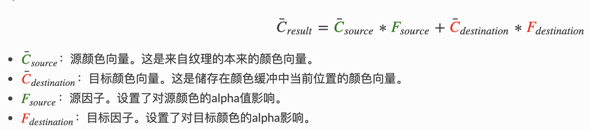

## OpenGLES 总结

### GLSL语言

### 定义

[修饰符]  [精度]  [基本类型]  [定义的变量名]

#### 修饰符

none： 可读可写，默认可省略

const：只读，不能修饰结构体中的变量

attribute：全局只读，只能在vertex shader中使用，能与浮点，向量，矩阵结合使用

uniform：全局只读，在着色结束前不会改变，可与任意基本类型组合

varying：vertex shader 和 fragment shader信使

一般在vertex中设置，fragment中使用，fragmemt不能修改

invariant 保证在不同的着色器中精度相同


#### 精度

lowp 低精度

mediump 中精度

highp 高精度

* 不同的精度运算取精度最高的
* 片元着色器使用浮点型，必须指定浮点精度

```glsl
precision mediump float;
```

通过precision指定默认精度

#### 基本类型

void，boolean，float，int

vec2，vec3，vec4  2/3/4维浮点数向量

bvec2，bvec3，bvec4  2/3/4维布尔向量

ivec2，ivec3，ivec4   2/3/4维整型向量

mat2，mat3，mat4  2/3/4维浮点矩阵

sampler2D 2D纹理

samplerCube 立方体纹理，有6个面，每个面都是一个2D纹理


#### 访问

* 按照坐标系访问：vec.xyzw
* 按照颜色访问：vec.raba
* 未知：vec.stpq
* 按照下标访问：vec[0]

vec.x = vec.r = vec.s = vec[0]

#### 运算

* float 和 int

只支持同类型运算

需先转换后运算

强制转换：int(1.0) / float(2)

* 逐分量运算

vec2(1.0,2.0,3.0) * 2.0 = vec2(2.0,4.0,6.0)

mat2(1.0,1.0,1.0,1.0) * 2.0 = vec2(2.0, 2.0, 2.0, 2.0)

vet/mat是浮点类型，不能和int运算

### 函数

* 函数不能递归调用
* 不能嵌套
* 如果无返回值，需要加void

#### 函数参数 限定符

in：默认，可读不可写，值传递，修改形参不会影响到实参

out：可写不可读，修改形参会改变实参

Inout： 可写可读，修改形参会改变实参

## OpenGLES 基本概念

### 清除窗口

#### 设置颜色缓存清楚值

glClearColor (red, blue, green, alpha)

GLES20.glClear(GLES20.GL_COLOR_BUFFER_BIT) ;清除,指定为颜色缓存

#### 设置深度缓冲清除值

glClearDepth(maxDepth)  范围：[0,1]

GLES20.glClear(GLES20.GL_DEPTH_BUFFER_BIT);清除,指定为深度缓存

深度缓存映射的是z轴，对应的的是视觉坐标系，反映片段距离眼睛的距离，大于maxDepth的部分不会被显示

#### 其他

GL_COLOR_BUFFER_BIT 颜色缓冲区

GL_DEPTCH_BUFFER_BIT 深度缓冲区

GL_ACCUM_BUFFER_BIT  累计缓冲区

GL_STENCIL_BUFFER_BIT  模版缓冲区

### 深度测试

深度就是3D像素点距离摄像机的距离，深度缓存存储着每个像素点的深度值

如果不使用深度测试，就需要控制绘制的顺序，需要先绘制距离摄像机远的，再绘制距离摄像机近的，否则距离摄像机远的像素可能会覆盖否则距离摄像机近的像素。

开启深度缓存后绘制顺序就不是那么重要了

#### 使用流程

1. 在onSurfaceCreated 中调用 GLES20.glEnable(GLES20.*GL_DEPTH_TEST*)，开启深度测试。

2. 在onDrawFrame 调用 GLES20.glClear(GLES20.*GL_DEPTH_BUFFER_BIT*)指定为深度缓存。

3. glDepthFunc 可以修改默认测试方式

   * GL_LESS（小于）；默认

   - GL_NEVER（没有处理）

   - GL_ALWAYS（处理所有）

   - GL_LEQUAL（小于等于）

   - GL_EQUAL（等于）

   - GL_GEQUAL（大于等于）

   - GL_GREATER（大于）

   - GL_NOTEQUAL（不等于）

### 混色 Blend

#### 透明

alpha 为0.6的物体由60%的自身颜色加%40背后物体颜色组成

alpha 为0.0的物体是完全透明的，颜色是100%背后物体的颜色

#### 混色



目标(destination)：先渲染的颜色，或叫已经渲染好的颜色

源(source)：后渲染的颜色，或叫现在正要渲染的颜色

#### glBlendFuncSeparate(GLenum srcRGB,GLenum dstRGB,GLenum srcAlpha,GLenum dstAlpha)

srcRGB 源颜色向量

dstRGB 目标颜色向量

srcAlpha 源透明因子

dstAlpha 目标透明向量

Color(result) = srcRGB * srcAlpha + dstRGB * dstAlpha

#### glBlendFunc(GLenum Source_factor, GLenum Destination_factor)

Source_factor 源透明因子

Destination_factor 目标透明向量

#### **glBlendEquation**(   GLenum *mode*)

设置源和目标的混合方程式

* **GL_FUNC_ADD**：Ar = As*sA + Ad*dA
* **GL_FUNC_SUBTRACT**：Ar = As*sA - Ad*dA
* **GL_FUNC_REVERSE_SUBTRACT**：Ar = Ad*dA - As*sA

